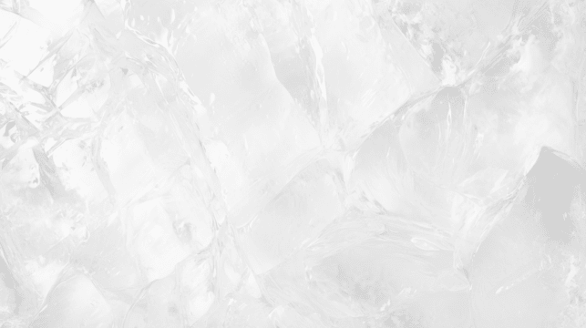

```aura width=800 height=200
<div style={{ position: 'relative', display: 'flex', width: '100%', height: '100%', background: '#a1f4ff52', borderRadius: 20, boxSizing: 'border-box', overflow: "hidden" }}>
  <svg width="800" height="200" viewBox="0 0 800 200" overflow="visible" xmlns="http://www.w3.org/2000/svg" style={{ position: 'absolute', top: 0, left: 0, pointerEvents: 'none', overflow: 'visible' }}>
    <defs>
      <linearGradient id="tw-holo-li" gradientUnits="objectBoundingBox" x1="0" y1="0" x2="1" y2="1">
        <stop offset="0%" stopColor="#a1f4ff52" />
        <stop offset="10%" stopColor="#ffffff" />
        <stop offset="30%" stopColor="#a1f4ffff" />
        <stop offset="60%" stopColor="#ffffff" />
        <stop offset="80%" stopColor="#a1f4ff52" />
        <stop offset="100%" stopColor="#a1f4ff52" />
        <animateTransform
          attributeName="gradientTransform"
          type="rotate"
          from="0 0.5 0.5"
          to="360 0.5 0.5"
          dur="8s"
          repeatCount="indefinite"
        />
      </linearGradient>
    </defs>
    <rect x="1.25" y="1.25" width="797.5" height="197.5" rx="18.75" ry="18.75" fill="none" stroke="url(#tw-holo-li)" strokeWidth="2" strokeLinecap="round" strokeLinejoin="round" />
    <rect x="0.25" y="0.25" width="799.5" height="199.5" rx="19.75" ry="19.75" fill="none" stroke="#ffffff" strokeWidth="0.5" strokeLinecap="round" strokeLinejoin="round" />
  </svg>
  <div style={{ position: 'relative', display: 'flex', flexDirection: 'row', alignItems: 'center', justifyContent: 'center', gap: "5px", flex: 1, width: '100%', height: '100%', boxSizing: 'border-box' }}>
  <p style={{fontSize: '30px', color: "#ffffff"}}>HELLO</p>
  </div>
  
</div>
```